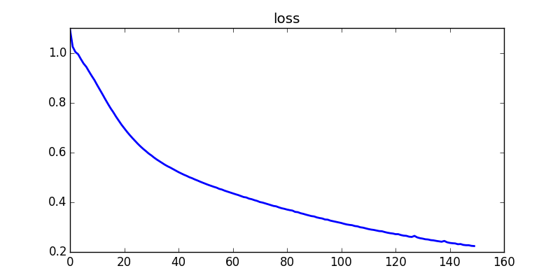
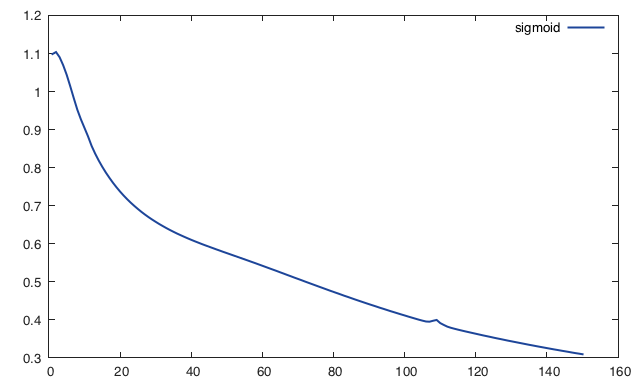

# mlp

多层神经网络，参考github项目[practical4](https://github.com/oxford-cs-ml-2015/practical4)

## practical

相当于practical4中的main.lua，区别在于practical4中动刀的优化算法是adagrad，我使用的是sgd，最终的准确率都是97.3%

python loss图

lua loss图

从图可知，python算法和lua吻合度很高
